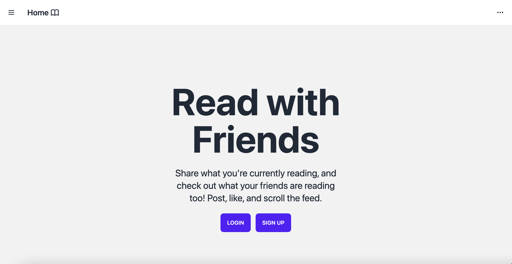

# Read with Friends
Read with Friends is a full stack web application that allows users to post about books they are reading, browse their feed, and like other users' book posts.

**Link to project:** Coming Soon

## How It's Made:

**Tech used:** HTML, Tailwind CSS, Daisy UI, JavaScript, EJS, Node, Express, Passport

Here's where you can go to town on how you actually built this thing. Write as much as you can here, it's totally fine if it's not too much just make sure you write *something*. If you don't have too much experience on your resume working on the front end that's totally fine. This is where you can really show off your passion and make up for that ten fold.

## Optimizations

I'm still working on the styling and functionality. I want to be able to add comments. 

## Lessons Learned:

No matter what your experience level, being an engineer means continuously learning. Every time you build something you always have those *whoa this is awesome* or *fuck yeah I did it!* moments. This is where you should share those moments! Recruiters and interviewers love to see that you're self-aware and passionate about growing.

